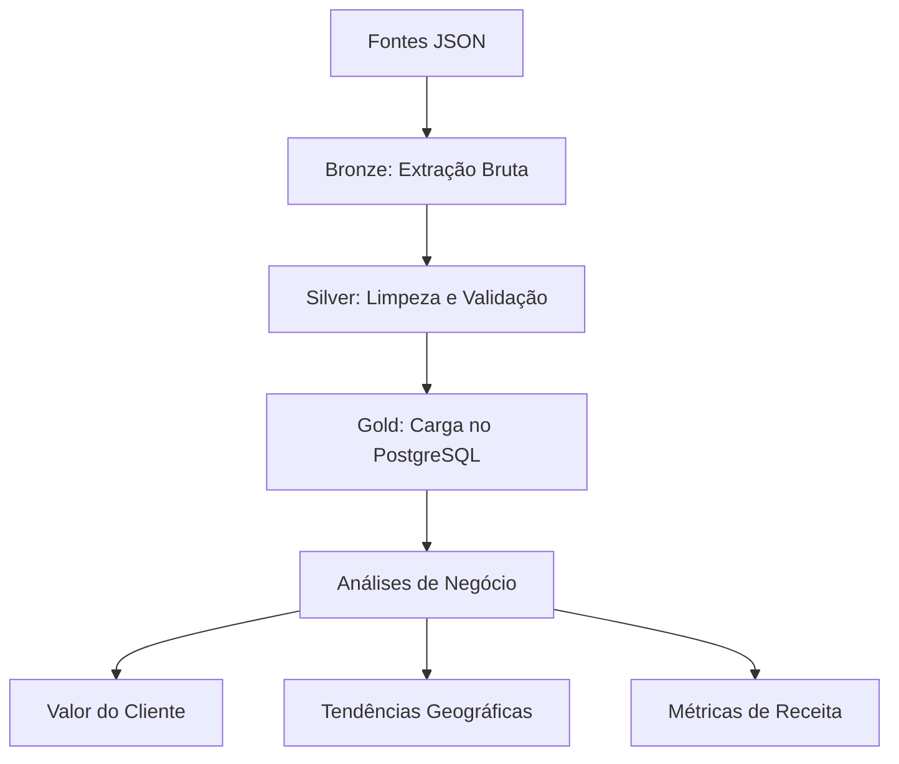

# Documentação

## Visão Geral

Este pipeline processa dados operacionais de e-commerce usando arquitetura medallion (Bronze - Silver - Gold). Ingere dados de clientes e transações de arquivos JSON, aplica transformações de qualidade e produz análises de negócio para identificar principais clientes, tendências geográficas e métricas de receita.

**Stack Tecnológico:** Python, Pandas, SQLAlchemy, PostgreSQL, Docker, Parquet

---

## Arquitetura

```
Bronze (Dados Brutos)      Silver (Limpos)            Gold (Analíticos)
├── customers/            ├── customers/             ├── customers/
├── transactions/         ├── orders/                └── orders/
├── reviews/              └── validated_data/
├── tickets/
├── inventory/
└── campaigns/
```

---

## Fluxo de Dados



---

## Conjuntos de Dados

### Camada Bronze

**CUSTOMERS (6 registros)**
```
customer_id, name, email, phone, registration_date,
address, country, birth_date, gender
```

**TRANSACTIONS (10 registros)**
```
transaction_id, customer_id, payment_method, amount,
currency, payment_date, status, gateway
```

**REVIEWS (10 registros)**
```
review_id, product_id, customer_id, rating, comment, review_date
```

**SUPPORT_TICKETS (5 registros)**
```
ticket_id, customer_id, subject, priority, status, resolution_time
```

### Camada Silver
- **Dados Limpos**: Email normalizado, datas padronizadas, relacionamentos validados
- **Qualidade**: 97%+ de completude dos dados

### Camada Gold
- **Top Clientes**: Clientes com maior valor de vida útil
- **Receita Geográfica**: Vendas por país com taxas de conversão
- **Análise de Pagamentos**: Performance por método de pagamento


---

## Execução

### Pré-requisitos
```bash
pip install -r requirements.txt
docker compose up -d
```


### Executar Análises
```bash
docker exec -it ecommerce_postgres psql -U postgres -d ecommerce
\i sql_queries.sql
```

---

## Resultados

### Métricas de Negócio

**1. Valor de Vida do Cliente**
```sql
SELECT 
    name, 
    country, 
    COUNT(*) AS orders, 
    SUM(amount) AS total_value
FROM customers c
JOIN orders o ON c.customer_id = o.customer_id
WHERE o.status = 'completed'
GROUP BY name, country
ORDER BY total_value DESC;
```

**2. Receita por País**
```sql
SELECT 
    country, 
    COUNT(DISTINCT customer_id) AS customers,
    SUM(amount) AS revenue
FROM customers c
JOIN orders o ON c.customer_id = o.customer_id
WHERE o.status = 'completed'
GROUP BY country
ORDER BY revenue DESC;
```

**3. Ticket Médio**
```sql
SELECT 
    ROUND(AVG(amount), 2) AS avg_order_value,
    COUNT(*) AS total_orders,
    SUM(amount) AS total_revenue
FROM orders
WHERE status = 'completed';
```

---

## Regras de Qualidade de Dados

| Entidade | Validação | Ação |
|--------|-----------|--------|
| Customers | Email deve conter @ | Descartar |
| Orders | Amount deve ser > 0 | Descartar |
| Orders | Customer deve existir | Descartar |
| Dates | Deve ser parseável | Converter ou descartar |

**Métricas de Qualidade:**
- Validade de email: 100%
- Parsing de datas: 98%+
- Integridade referencial: 100%


---

## Decisões Técnicas

### Por que Pandas?
- Dataset pequeno (< 1 GB)
- Transformações simples
- Desenvolvimento rápido

### Por que Parquet?
- 60-80% menor que CSV
- Preserva tipos de dados
- Leituras mais rápidas com filtros

### Por que Arquitetura Medallion?
- **Bronze**: Preserva dados brutos (auditoria)
- **Silver**: Dados limpos (controle de qualidade)
- **Gold**: Pronto para negócio (análises rápidas)

---

## Soluções de Arquitetura

### Opções de Deploy em Cloud

**AWS:**
- S3 (Armazenamento Bronze/Silver)
- AWS Glue (ETL)
- RDS PostgreSQL (Camada Gold)
- QuickSight (Analytics)

**Azure:**
- Blob Storage (Bronze/Silver)
- Data Factory (ETL)
- Azure Database (Camada Gold)
- Power BI (Analytics)


---

